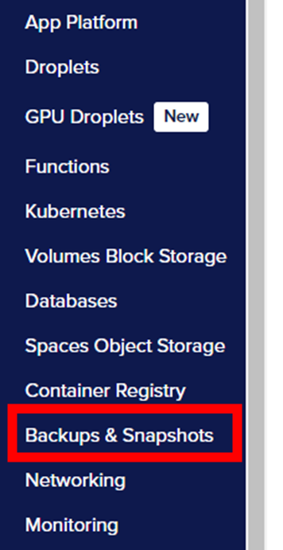
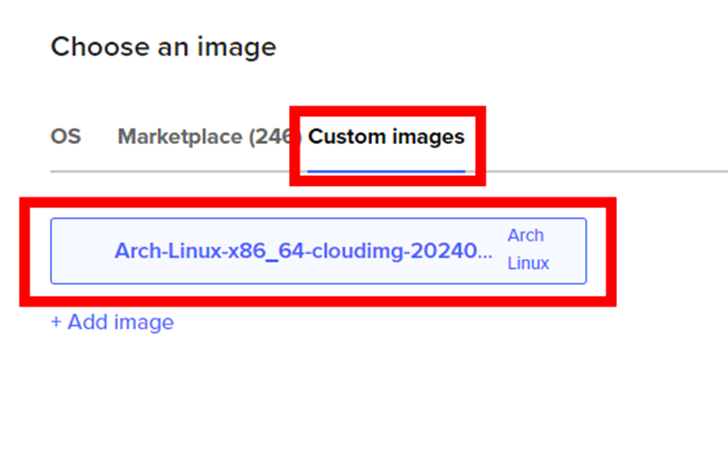

# How to Set up Arch Linux on a DigitalOcean Droplet (Level 2)

# Introduction
DigitalOcean is a cloud computing platform that allows you to create virtual machine instances called Droplets on their servers. This allows you to access your remote server from anywhere as well as relieving your own machine of its resources.

# Overview
This guide is desgined with the base knowledge of a CIT student entering term 2 in week 1. This guide will also take you through:

1. [Download Custom Arch Linux Image](#download-custom-arch-linux-image)
2. [Upload custom image onto DigitalOcean](#upload-custom-image-to-digitalocean)
3. [Creating the SSH Key Pair](#creating-the-ssh-key-pair)
4. [Connecting Your Public Key to DigitalOcean](#connecting-your-public-key-to-digitalocean)
5. [Creating the cloud-init Configuration File](#creating-the-cloud-init-configuration-file)
6. [Creating up your DigitalOcean Droplet with Arch Linux](#creating-your-droplet-on-digitalocean)
7. [Implementing the cloud-init Configuration File to Automate Initial Setup Tasks](#implementing-the-cloud-init-configuration-file)
8. Lastly, this guide will show you how to connect to your remote server using the SSH keys.

## Download Custom Arch Linux Image
Before beginning, first you need to download a custom Arch Linux image from: 

https://gitlab.archlinux.org/archlinux/arch-boxes/-/packages/

Make sure to select the latest image post. Also, make sure the download contains the word "cloudimg" and ends with the file extension ".qcow2".

## Upload Custom Image to DigitalOcean
By uploading our own custom image, we can use it to create our Droplets with Arch Linux. This allows us to create a consistent environment by utilizing the custom image alongside our own cloud-init settings. 

1. Click **Manage** on the left-hand side menu

<br></br>

2. Select **Backups & Snapshots** from the left menu

<br></br>

3. Select **Custom Images**

<br></br>

4. Select **Upload Image**

<br></br>

5. Find the Arch Linux image that you downloaded and open it

<br></br>

6. Click on **Distribution** and from the drop-down list, select **Arch Linux**

<br></br>

7. Select a datacenter and click **Upload Image**
Note: You want to select the server closest to your location to reduce latency and improve response times.


## Creating the SSH Key Pair
In order for you to securely connect your current machine to the remote server, you must first create an SSH key pair from your current machine and upload the public key onto DigitalOcean for it to connect. Generating the keys will give you two text files: a public key and private key. The private key is always kept for yourself and 

If you are running Windows and have never made an SSH key before, you may need to create a .ssh folder in your home directory. You can perform this by opening Windows PowerShell/terminal and typing the command:

```
mkdir .ssh
```
*mkdir - creates a new directory*
*.ssh - the name of the directory*

Double check that the directory was created or exists by typing the command:
```
ls
```
*ls - list directory contents*

<br></br>

1. Type the following command to create a new SSH key pair:
```
ssh-keygen -t ed25519 -f C:\Users\your-user-name\.ssh\name-of-key -C "your-email@email.com"
```
**Note**: Change "your-user-name" to the correct name in the terminal. Change the "name-of-key" to something relevant such as do-key as well as change "your-email.com" to your actual email.

*ssh-keygen - generates a new public and private key*
*-t -what type of key (in our case an encrypted txt file)*
*ed25519 - an encryption algorithm*
*-f - specifies the name of the file and location in which to store the key*
*-C - attaches comment to a key*

## Connecting your Public Key to DigitalOcean
Now that you have generated your keys, we have to add the public key onto DigitalOcean.

1. Type the command below to copy the SSH key we just made onto your clipboard
```
Get-Content C:\Users\your-user-name\.ssh\do-key.pub | Set-Clipboard
```
**Note**: Make sure to change "your-user-name" to the correct name in the terminal. Also make sure the name of the key ends in ".pub"

2. On DigitalOcean, click **Settings**

<br></br>

3. Select the **Security** tab and then click **Add SSH Key**

<br></br>

4. Paste the contents from the clipbnoard into the **Public Key** section and type a name for your public key

<br></br>

5. Click **Add SSH Key** when completed

## Creating the cloud-init Configuration File
Now we will create our cloud-init file. The file, which a YAML file, helps us automatically configure and set up our Droplets. After creating our cloud-init file, we will be able to upload the same starting setup to every single Droplet, allowing a consistent environment and reduced setup time.

For our cloud-init file, the file will:
1. create a new regular user
2. install some initial packages
3. add our public key to the authorized_keys file in our new users home directory
4. disable root access via SSH


1. Open Notepad 
2. Copy and paste the following code below into your Notepad
<!-- a couple thinies here -->

```
#cloud-config
users:
  - name: user-name #change me
    primary_group: group-name #change me
    groups: wheel
    shell: /bin/bash
    sudo: ['ALL=(ALL) NOPASSWD:ALL']
    ssh-authorized-keys:
      - ssh-ed25519 ... #change me

packages:
  - ripgrep
  - rsync
  - neovim
  - fd
  - less
  - man-db
  - bash-completion
  - tmux

disable_root: true
```
**Note**: Change user-name to a name of your choice. As for primary_group, changing it to "users" is a safe starting choice. Also, change the "ssh-ed25519 ..." to the same SSH key we copied from earlier in Step 1 in [Connecting your Public Key to DigitalOcean](#connecting-your-public-key-to-digitalocean).
* *sudo: ['ALL=(ALL) NOPASSWD:ALL'] - this allows all users to use the sudo command without a password. sudo allows an elevated level of power in performing commands in linux.*
* *packages - all packages inside will be downloaded upon initialization*
* *disable_root: true - this prevents users from accessing the remote server as a root user through SSH*

3. Save the file as a ".txt" and keep it in a location you can access it easily

## Creating your Droplet on DigitalOcean

1. On DigitalOcean, click **Create** and select **Droplets** from the top-right-hand corner


2. Select the region closest to your current location to ensure low response times


3. Select **Custom images** and select the custom Arch Linux image we uploaded in [Upload custom image onto DigitalOcean](#upload-custom-image-to-digitalocean)



4. Select **Basic** plan, then select **Premium AMD** and then for our use-case we will select **$7/mo** option.  


5. Select **SSH Key** as Authentication method and ensure your SSH key is checked off.


## Implementing the cloud-init Configuration File
Using DigitalOcean, they provide a free initialization scripts. This allows us to directly paste our code into that section and have DigitalOcean run the cloud-init YAML code for us.

1. Under the SSH key from Step 5 of [Creating your Droplet on DigitalOcean](#creating-your-droplet-on-digitalocean), Select **Advanced Options** and Check the box for **Add Initialization Scripts (free)**


2. From your cloud-init file earlier, copy and paste the contents into the textbox on DigitalOcean


3. Enter a memorable Hostname so you can distinguish each droplet between each other


4. Double check everything is correct and then click **Create Droplet** on the bottom of the screen.

